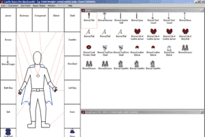
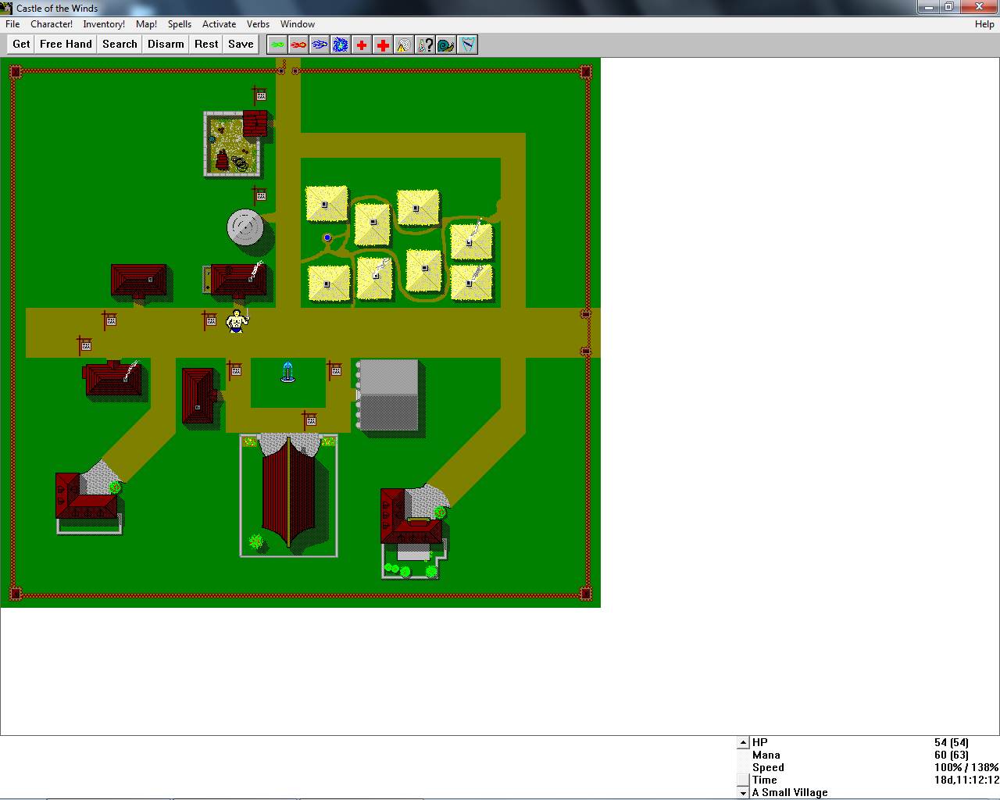

# Castle of the Winds

_Castle of the Winds: Lifthransir's Bane_  
_Castle of the Winds: A Question of Vengeance_

<https://github.com/timdetering/Castle_of_the_Winds>

Castle of the Winds is a tile-based roguelike video game for Microsoft Windows.

## Description

Castle of the Winds is a fun graphical Roguelike RPG designed by Rick Saada and published as shareware by Epic-Megagames.

The game contains 2 episodes: the first was titled "A Question of Vengeance" and is distributed as shareware. The second is "Lifthransir's Bane" and had a $25 registration price tag. The game is played from a top-down perspective, and like other Roguelike games, it has one huge dungeon with 25 levels deep.

Your goal in the first episode is to retrieve an an ancient helm to rightfully claim the throne that is your birthright. Barring your path is the powerful demon lord Surtur. The gameplay is the same as other Roguelikes. You explore dungeons, evade or disarm traps, defeat monsters, and find treasures and powerful magical items will help you against the demon.

The graphics in the game is somewhat cheesy, but passable for a Roguelike. The actually gameplay is deep and involving. There are hundreds of spells and weapons to use, and plenty of monsters to slay. Although it is far from the level of complexity in NetHack or ADOM, Castle of the Winds is fun, intuitive, and easy to get into.

If you enjoy Roguelikes, you will like this "lite" shareware game that has recently been released into the public domain by its author. Highly recommended!

<https://www.myabandonware.com/game/castle-of-the-winds-1ph>

----

It's a top-scroller that uses a "Your move-My move" system. This is multiplied about 30 times because every enemy on the level is allowed a move for every one of yours, but they don't all know where you are right away. It has a good and somewhat optional storyline, for the replay factor. When you create a new character you can distribute ability points between three characteristics, and select their gender and name. The levels and weapon abilities are randomly generated for an extremely high replay value.

The graphics left quite a bit to the imagination..

About to leave the little farming village and head out on adventure

Your Character's Inventory screen

Ooops, maybe I should read the manual again

The village of Bjarnarhaven. (Running on Windows 7)

The character screen. (Running on Windows 7)

Map (Running on Windows 7)

Customizing the spell menu. (Running on Windows 7)

Looking in the spellbook, for spells not in the spell menu. (Running on Windows 7)

The town of Crossroads. (Running on Windows 7)

A bit of story. (Running on Windows 7)

Not many choices on level up. (Running on Windows 7)

Tough crowd! But nice to be able to use Map Level scrolls at least. (Running on Windows 7)

Not much of a victory screen, but a victory nevertheless. (Running on Windows 7)

This is how the game appeared in Epic's 1992 catalogue

<https://www.mobygames.com/game/win3x/castle-of-the-winds>

----

Rick Saada:

> Years ago, back in the late 80's I was trying to learn Windows programming to get off of DOS Word, where I was then working.  Naturally, I decided to write a computer game.  What I didn't expect was that Castle of the Winds would generate some 13500 registrations, and continue to generate an mail to this day.  At this point, I give the game away for free.  Here's a zip with both part one (the free part) and part two (the part you had to register to get).  Castl11A.zip Have fun!

## External links

* Wikipedia <https://en.wikipedia.org/wiki/Castle_of_the_Winds>
* The Rick Saada Home Page <https://web.archive.org/web/20110717071112/http://www.exmsft.com/~ricks/>
* Web-based <http://game.castleofthewinds.com/>
* My Abandonware (original?) Windows 3.1 binaries <https://www.myabandonware.com/game/castle-of-the-winds-1ph>
* Web-based emulated <https://classicreload.com/castle-or-the-winds.html>
